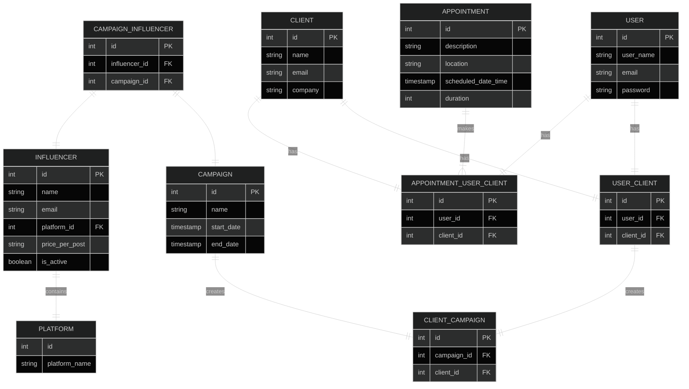

# Swim Marketing

In today’s industry, **93% of marketers worldwide are using social media business**. In 2022, almost 92% of marketers who work for companies with more than 100 employees in the United States are expected to start using social media for marketing. In recent years, influencer marketing has really been on the rise. What was a $1.7 billion industry in 2016 has since grown to become a **$9.7 billion industry in 2020**. In just 2021, it grew to $13.8 billion and is projected to expand to $15 billion in 2022. As this marketing strategy goes from strength to strength, the model continues to expand into new areas and approaches. Emerging from this is the concept of Social Media Influencer Pooling, which essentially allows companies that would normally spend X amount of a marketing budget on a single large influencer to split this budget amongst a ‘pool’ of smaller more affordable influencers, to increase the diversity of their marketing reach, rather than be specific to one following. A number of individuals spearheading this idea have already noted successful results using this strategy. However, as it is a very new approach, there is no bespoke software to help organise and manage Social Media Influencer Pooling.

## Goals

- Have a single tool to manage all the stages of SMIP
- Manage clients, influencers and campaigns
- A directory of suggested influencers based on campaign type and previous work
- Client email generator (initial enquiry, campaign proposal, contracts, confirmation )
- Track the timeline of a campaign
- Track the status of each influencer within a campaign
- Pricing Calculator

## Solution

An application that allows marketing managers to control all aspects of their SMIP work, from initial client outreach all the way through to the competition of a campaign.

## Project Outline

**MVP**

- Create a User Account & Password - Marketing Manager (independent session per user for MVP)
- Create a client
- Create an influencer
- Create a influencer pool/group
- Calendar to track appointments/planned campaigns (filterable)
- Ability to update the status of a campaign (on an influencer level but also overall)

**V1/Stretch Goals**

- Push Notifications
- Email generator (mail merge situation)
- Automatically send email updates to clients based on status
- Flag overdue campaigns/influencer posts
- Pricing Calculator
- Create suggested pools for clients based on categories & budget

## Domain Model


## ERD



## API Specification

#### USERS

``GET /users/`` Return a list of all of users

Response - ``200 OK``
```
[
  {
        "id": 1,
        "user_name": 'John Smith',
        "email": 'john.smith@gmail.com',
  },
]
```
______

``GET /users/{userId}`` Return a user by id

Response - ``200 OK``
```

  { "id": 1, "client_name":'Alice Smith', "email",'alice.smith@example.com'}

```
______


``POST /users`` Create a new user

Request
```
  {
        "user_name": 'John Smith',
        "email": 'john.smith@gmail.com',
        "password": 'password123'
  }

Response - ``201 Created``
```
______


``PUT /users/{userId}`` Update a user by ID

Request
```
  {
        "id": 1,
        "user_name": 'John Smith',
        "email": 'john.smith@gmail.com',
        "password": 'password123'
  },


Response - ``204 No Content``
```
______


#### CLIENTS

``GET /clients/users/{userId}`` Return a list of all of a users's clients

Response - ``200 OK``
```
[
  {
        "id": 1,
        "client_name": 'John Smith',
        "email": 'john.smith@gmail.com',
        "company_name": 'TilesRUs'
  },
  {
        "id": 2,
        "client_name": 'Jane Smith',
        "email": 'jane.smith@gmail.com',
        "company_name": 'Smith Sales'
  }
]
```
______

``GET /clients/{clientId}`` Return a client by id

Response - ``200 OK``
```

  { "id": 1, "client_name":'Alice Smith', "email",'alice.smith@example.com', "company_name": 'Smith Sales'}

```
______


``PUT /clients/{clientId}`` Update client details

Request
```
[
  { "client_name":'Alice Smyth', "email",'alice.smith@example.com', "company_name": 'Smith Sales'}
]
```
______

Response - ``204 No Content``
```

``DELETE /clients/{clientId}`` Delete a client by id

Response - ``204 No Content``
```
______

#### CAMPAIGNS

``POST /campaigns`` Create a new campaigns

Request
```

  {
    "campaign_name": 'Spring Promotion',
    "campaign_start_date": '2023-03-01',
    "end_date": '2023-03-31',
    "client_id": 1,
    "user_id": 1
  },

```

Response - ``201 Created``
______

``PUT /campaigns/{campaignId}`` Update a campaign

Request - ``200 OK``
```

  {
    "campaign_name": 'Spring Promotion',
    "campaign_start_date": '2023-03-01',
    "end_date": '2023-03-31',
    "client_id": 1,
    "user_id": 1
  },

```

Response - ``204 No Content``
______


``GET /campaigns/{campaignId}`` Return a campaign by Id

Response - ``200 OK``
```
[
  {
    "id": 1,
    "campaign_name": 'Spring Promotion',
    "campaign_start_date": '2023-03-01',
    "end_date": '2023-03-31',
    "client_id": 1,
    "user_id": 1
  },
]
```
______


``GET /campaigns`` Return a list of all campaigns

Response - ``200 OK``
```
[
  {
    "id": 1,
    "campaign_name": 'Spring Promotion',
    "campaign_start_date": '2023-03-01',
    "end_date": '2023-03-31'
    },
  {
    "id": 2,
    "campaign_name": 'Summer Promotion',
    "campaign_start_date": '2023-06-01',
    "end_date": '2023-06-31'
  },
    {
     "id": 3,
    "campaign_name": 'Autumn Promotion',
    "campaign_start_date": '2023-09-01',
    "end_date": '2023-09-31'
  }
]
```
______


``GET /campaigns/{campaignId}/influencers`` Return a list of all a campaigns' influencers

Response - ``200 OK``
```
[
  {
        "id": 1,
        "fullname": 'John Jones',
        "email": 'john.jones@example.com',
        "platform_id": 1,
        "price_per_post": '£100',
        "is_active": 'true'
    },
    {
        "id": 2,
        "fullname": 'Jane Smith',
        "email": 'jane.smith@example.com',
        "platform_id": 2,
        "price_per_post": '£200',
        "is_active": 'true'
    }
]
```
______

``DELETE /campaigns/{campaignId}`` Delete a campaign by id

Response - ``204 No Content``
______
______

#### INFLUENCERS

``POST /influencers`` Create a new influencer

Request
```

  {
        "fullname": 'John Jones',
        "email": 'john.jones@example.com',
        "platform_id": 1,
        "price_per_post": '£100',
        "is_active": 'true'
  },

```

Response - ``201 Created``
______

``PUT /influencers/{influencerId}`` Update an influencer by id

Request
```

  {
        "fullname": 'John Jones',
        "email": 'john.jones@example.com',
        "platform_id": 1,
        "price_per_post": '£100',
        "is_active": 'true'
  },

```

Response - ``204 No Content``
______

``GET /influencers/{influencerId}`` Return an influencer by id

Response - ``200 OK``
```
[
   {
        "id": 1,
        "fullname": 'John Jones',
        "email": 'john.jones@example.com',
        "platform_id": 1,
        "price_per_post": '£100',
        "is_active": 'true'
    }
]
```
______


``GET /influencers`` Return a list of all influencers

Response - ``200 OK``
```
[
   {
        "id": 1,
        "fullname": 'John Jones',
        "email": 'john.jones@example.com',
        "platform_id": 1,
        "price_per_post": '£100',
        "is_active": 'true'
    },
    {
        "id": 2,
        "fullname": 'Jane Smith',
        "email": 'jane.smith@example.com',
        "platform_id": 2,
        "price_per_post": '£200',
        "is_active": 'true'
    }
]
```
______


``GET /influencers/{influencerId}/campaigns`` Return a list of all an influencer's campaigns

Response - ``200 OK``
```
[
  {
    "id": 1,
    "campaign_name": 'Spring Promotion',
    "campaign_start_date": '2023-03-01',
    "end_date": '2023-03-31'
    },
  {
    "id": 2,
    "campaign_name": 'Summer Promotion',
    "campaign_start_date": '2023-06-01',
    "end_date": '2023-06-31'
  },
    {
     "id": 3,
    "campaign_name": 'Autumn Promotion',
    "campaign_start_date": '2023-09-01',
    "end_date": '2023-09-31'
  }
]
```
______

``DELETE /influencers/{influencerId}`` Delete an influencer by id

Response - ``204 No Content``
______

#### APPOINTMENTS

``POST /appointments`` Create a new appointment

Request
```

  {
        "scheduled_date_time": '2022-01-01 10:00:00',
        "duration": 60,
        "description": 'Figures Meeting', 
        "location": 'zoom.link'
  },

```

Response - ``201 Created``
______

``PUT /appointments/{appointmentId}`` Update an appointment by id

Request
```

  {
        "scheduled_date_time": '2022-01-01 10:00:00',
        "duration": 60,
        "description": 'Figures Meeting', 
        "location": 'zoom.link'
  },

```

Response - ``204 No Content``
______

``GET /appointments/{appointmentId}`` Return an appointment by id

Response - ``200 OK``
```

   {
        "id": 1,
        "scheduled_date_time": '2022-01-01 10:00:00',
        "duration": 60,
        "description": 'Figures Meeting', 
        "location": 'zoom.link'
    }

```
______


``GET /appointments`` Return a list of all appointments

Response - ``200 OK``
```
[
   {
        "id": 1,
        "scheduled_date_time": '2022-01-01 10:00:00',
        "duration": 60,
        "description": 'Figures Meeting', 
        "location": 'zoom.link'
    },
    {
        "id": 2,
        "scheduled_date_time": '2022-01-02 10:00:00',
        "duration": 30,
        "description": 'Discuss Spring Campaign', 
        "location": 'Meeting Room 2'
    }
]
```
______

``GET /appointments/user/{userId}`` Return a list of all a users's appointments

Response - ``200 OK``
```
[
   {
        "id": 1,
        "scheduled_date_time": '2022-01-01 10:00:00',
        "duration": 60,
        "description": 'Figures Meeting', 
        "location": 'zoom.link'
    },
    {
        "id": 2,
        "scheduled_date_time": '2022-01-02 10:00:00',
        "duration": 30,
        "description": 'Discuss Spring Campaign', 
        "location": 'Meeting Room 2'
    }
]
```
______

``GET /appointments/client/{clientId}`` Return a list of all a client's appointments

Response - ``200 OK``
```
[
   {
        "id": 1,
        "scheduled_date_time": '2022-01-01 10:00:00',
        "duration": 60,
        "description": 'Figures Meeting', 
        "location": 'zoom.link'
    },
    {
        "id": 2,
        "scheduled_date_time": '2022-01-02 10:00:00',
        "duration": 30,
        "description": 'Discuss Spring Campaign', 
        "location": 'Meeting Room 2'
    }
]
```
______

``DELETE /appointments/{appointment}`` Delete an appointment by id

Response - ``204 No Content``
______

